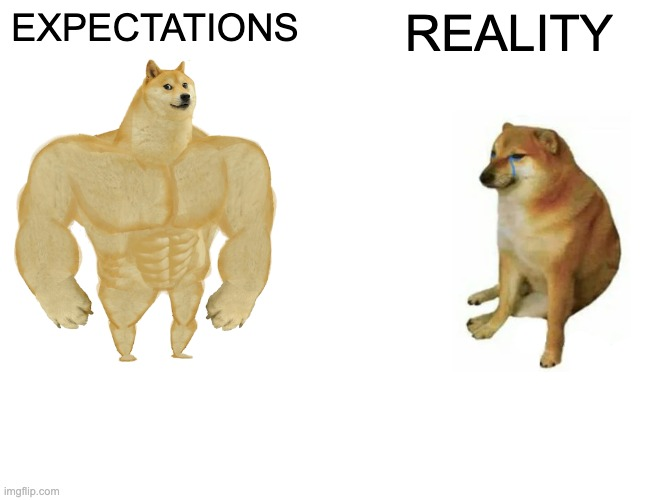

## How did you make your effort estimates?
My effort estimates were mostly based on best guesses using experience from previous assignments. I usually work on tasks pretty on and off instead of in long continuous sessions, which makes it hard to give very precise estimates upfront. If a task was similar to something we had already done before, I used those past assignments as a rough baseline. For features or functionality we had never implemented before, I would usually estimate about double what I initially thought it would take to account for research, learning, and unexpected problems.

## Even though your estimates were often off, did estimating in advance provide any benefit?
Estimating in advance did benefit me overall, even when my estimates were off, estimating ahead of time was still helpful. It forced me to think through the task before starting and consider what parts might be more complicated than they first appeared. A lot of tasks that seemed simple at first ended up taking longer because of integration issues or edge cases. Having an estimate helped me better prepare for the scope of the work and prioritize tasks that I knew were more likely to grow in complexity.

## Was tracking actual effort useful? If so, how did it inform future estimates or project decisions?
Tracking actual effort helped me notice patterns in how I work, especially how much time gets lost due to context switching and working intermittently. Because I didn’t always work in long sessions, the total time spent on a task was often higher than I expected, even if the actual coding was straightforward. This made it clear that research, debugging, and revisiting code after breaks consistently took more time than I accounted for. After seeing this, I started adding more buffer time to my estimates and avoided assuming tasks could be finished quickly in short bursts.

## How did you track your actual effort (tools, method)? How accurate do you believe your tracking was?
I tracked my effort using rough manual time estimates based on when I worked on tasks, along with commit history and when tasks were completed. Because of my on-and-off work style due to my scheduling, this means my tracking wasn’t very precise. Short sessions, interruptions, and quick debugging runs were hard to capture accurately. Overall, I think my tracking reflects the amount of effort not very accurately due to how I work on tasks.

## Reflection: what would you change about your estimation or tracking process next time?
Next time, I would rely less on intuition alone and use more concrete data from previous tasks to make estimates, especially for research and debugging. I would also break estimates into clearer categories like implementation, research, and debugging instead of lumping everything into one number. For tracking, using tools to track online time or time-blocking approaches would help capture extremely fragmented work sessions more accurately.

